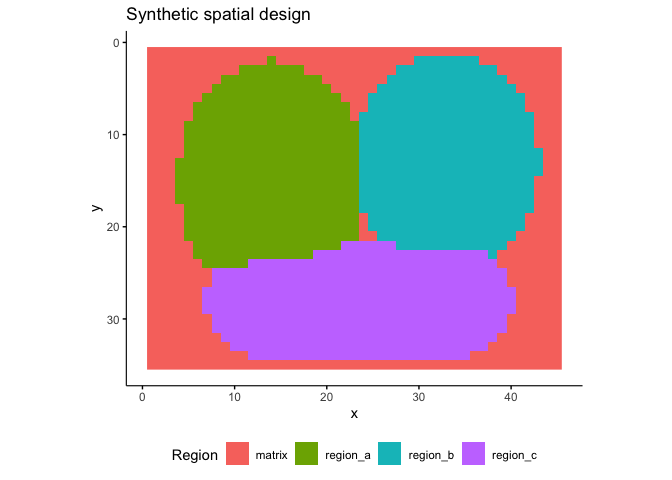
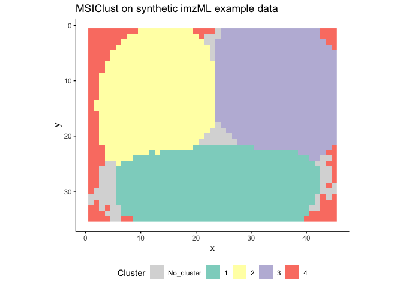

Using MSIClust
================
Rscripts MSI clustering workflow
2026-05-24

- [Purpose](#purpose)
- [What MSIClust Does](#what-msiclust-does)
- [Packages](#packages)
- [Input Format](#input-format)
- [Load Helpers](#load-helpers)
- [From Cardinal Object to Data
  Frame](#from-cardinal-object-to-data-frame)
- [Synthetic Example Data](#synthetic-example-data)
- [Run MSIClust](#run-msiclust)
- [Plot the Cluster Map](#plot-the-cluster-map)
- [Output Object](#output-object)
- [Important Parameters](#important-parameters)
- [Under the Hood](#under-the-hood)
- [Necessary Functions](#necessary-functions)
- [Troubleshooting](#troubleshooting)
  - [No valid neighbors](#no-valid-neighbors)
  - [Too many `No_cluster` pixels](#too-many-no_cluster-pixels)
  - [Feature columns are not found](#feature-columns-are-not-found)

# Purpose

This vignette shows how to run **MSIClust** on an MSI pixel data frame.
It only covers the MSIClust workflow and the helper functions needed to
prepare input, run the clustering, inspect the fuzzy memberships, and
plot the result.

The reusable MSIClust implementation now lives in one standalone script:

| Script | What it provides |
|----|----|
| `MSIClust_helpers.R` | Data-frame construction, MSIClust preparation, neighbor correlations, fuzzy clustering, label handling, and cluster plotting. |

# What MSIClust Does

MSIClust is used here as a spatially adaptive fuzzy clustering workflow
for MSI pixels. It runs fuzzy c-means through `vsclust`, but gives each
pixel its own fuzzifier based on how similar that pixel is to its local
neighbors.

The core idea is:

1.  Each pixel has an intensity spectrum across `mz_` features.
2.  Neighboring pixels are compared by spectral correlation.
3.  Local disagreement is converted to
    `inv_cor = 1 - avg_corr_neighbors`.
4.  `inv_cor` is scaled by `cor_scale`.
5.  `vsclust::determine_fuzz()` converts the scaled values into
    per-pixel fuzzifiers.
6.  `vsclust::vsclust_algorithm()` runs fuzzy clustering.
7.  Pixels with weak maximum membership are labelled `No_cluster`.

# Packages

``` r
library(dplyr)
library(ggplot2)
library(matrixStats)
library(RColorBrewer)
library(vsclust)
```

If you are starting from imzML/Cardinal data, you also need:

``` r
library(Cardinal)
library(BiocParallel)
```

The included synthetic imzML example was generated with `CardinalIO`;
you only need `CardinalIO` if you want to regenerate those example
files.

# Input Format

MSIClust expects one row per pixel:

| Column     | Required | Description                       |
|------------|---------:|-----------------------------------|
| `x`        |      yes | Pixel x coordinate.               |
| `y`        |      yes | Pixel y coordinate.               |
| `mz_*`     |      yes | Numeric ion-intensity columns.    |
| `runNames` |       no | Optional run or slide identifier. |

The `mz_` columns are the clustering features. Other metadata columns
can be present, but the core helper functions look for `x`, `y`, and
`mz_...`.

# Load Helpers

``` r
script_root <- if (basename(getwd()) == "docs") {
  normalizePath("..", mustWork = FALSE)
} else {
  normalizePath(".", mustWork = FALSE)
}

source(file.path(script_root, "MSIClust_helpers.R"))
```

# From Cardinal Object to Data Frame

If you already have `msi_df`, skip this section. If you have a binned
Cardinal MSI object, convert it with `make_msi_dataframe()`.

``` r
msi_df <- make_msi_dataframe(msi_data_binned)

head(msi_df[, c("runNames", "x", "y")])
grep("^mz_", names(msi_df), value = TRUE)[1:5]
```

A minimal Cardinal route from imzML looks like this:

``` r
msi_data <- Cardinal::readImzML(
  imzml_path,
  memory = FALSE,
  check = FALSE,
  resolution = 10,
  units = "ppm",
  BPPARAM = BiocParallel::bpparam()
)

control_mean <- Cardinal::summarizeFeatures(msi_data, "mean")
mz_ref <- read.table(mz_ref_path, header = TRUE)$Centroid

control_ref <- control_mean |>
  Cardinal::peakPick(SNR = 3) |>
  Cardinal::peakAlign(ref = mz_ref, tolerance = 0.5, units = "mz") |>
  Cardinal::subsetFeatures() |>
  Cardinal::process()

msi_data_binned <- Cardinal::bin(
  msi_data,
  ref = Cardinal::mz(control_ref),
  tolerance = 0.5,
  units = "mz",
  BPPARAM = BiocParallel::bpparam()
) |>
  Cardinal::process()

msi_df <- make_msi_dataframe(msi_data_binned)
```

# Synthetic Example Data

This vignette uses a compact synthetic imzML/ibd pair generated
specifically for demonstrating MSIClust. The files are in
`docs/example_data/Synthetic_MSIClust/`.

The synthetic data contain a 45 x 35 pixel image with 120 m/z features.
Four spatial regions were simulated with shared peaks, region-specific
peaks, smooth spatial transitions, pixel-level scaling, and noise. The
synthetic region labels are included only to show how the example was
made; MSIClust does not use them.

To regenerate the example files:

``` r
system2(
  "Rscript",
  file.path(
    script_root,
    "docs",
    "example_data",
    "Synthetic_MSIClust",
    "generate_synthetic_msiclust_imzml.R"
  )
)
```

``` r
source(file.path(script_root, "MSIClust_helpers.R"))

library(Cardinal)
library(ggplot2)

synthetic_dir <- file.path(
  script_root,
  "docs",
  "example_data",
  "Synthetic_MSIClust"
)

example_imzml <- file.path(
  synthetic_dir,
  "synthetic_msiclust.imzML"
)

synthetic_design <- read.csv(
  file.path(synthetic_dir, "synthetic_msiclust_design.csv"),
  stringsAsFactors = FALSE
)

example_msi <- Cardinal::readImzML(
  example_imzml,
  memory = FALSE,
  check = FALSE
)

example_df <- make_msi_dataframe(example_msi)
example_signal_cols <- msiclust_signal_columns(example_df)
example_mz <- msiclust_feature_mz_values(example_signal_cols)

example_data_summary <- data.frame(
  property = c(
    "pixels",
    "m/z features",
    "image grid",
    "minimum m/z",
    "maximum m/z",
    "simulated regions"
  ),
  value = c(
    nrow(example_df),
    length(example_signal_cols),
    paste0(
      length(unique(example_df$x)),
      " x ",
      length(unique(example_df$y))
    ),
    sprintf("%.4f", min(example_mz, na.rm = TRUE)),
    sprintf("%.4f", max(example_mz, na.rm = TRUE)),
    length(unique(synthetic_design$synthetic_region))
  ),
  stringsAsFactors = FALSE
)

knitr::kable(example_data_summary)
```

| property          | value    |
|:------------------|:---------|
| pixels            | 1575     |
| m/z features      | 120      |
| image grid        | 45 x 35  |
| minimum m/z       | 400.0000 |
| maximum m/z       | 900.0000 |
| simulated regions | 4        |

The synthetic design map below is shown only as context for the reader.

``` r
ggplot(
  synthetic_design,
  aes(x = .data$x, y = .data$y, fill = .data$synthetic_region)
) +
  geom_raster() +
  coord_equal() +
  scale_y_reverse() +
  labs(
    title = "Synthetic spatial design",
    x = "x",
    y = "y",
    fill = "Region"
  ) +
  theme_minimal() +
  theme(
    axis.line = element_line(color = "black", linewidth = 0.4),
    axis.ticks = element_line(color = "black"),
    panel.grid = element_blank(),
    legend.position = "bottom"
  )
```

<!-- -->

Run MSIClust on the intensities only:

``` r
example_prep <- prepare_msiclust_input(
  msi_df = example_df,
  normalize_method = "tic",
  feature_standardize = "sd",
  neighbor_radius = 1,
  cor_cores = 1,
  cor_scale = 25
)

example_res <- run_msiclust(
  prep = example_prep,
  nclust = 4,
  iter_max = 100,
  min_membership = 0.5,
  seed = 1
)

example_clustered <- append_msiclust_labels(example_prep, example_res)

example_counts <- as.data.frame(
  table(example_clustered$MSIClust_cluster),
  stringsAsFactors = FALSE
)
names(example_counts) <- c("cluster", "pixels")

knitr::kable(example_counts)
```

| cluster    | pixels |
|:-----------|-------:|
| 1          |    460 |
| 2          |    431 |
| 3          |    462 |
| 4          |    142 |
| No_cluster |     80 |

``` r
example_diagnostics <- data.frame(
  metric = c(
    "minimum max membership",
    "median max membership",
    "maximum max membership",
    "minimum fuzzifier",
    "maximum fuzzifier"
  ),
  value = round(
    c(
      min(example_res$max_membership),
      stats::median(example_res$max_membership),
      max(example_res$max_membership),
      min(example_res$model$fuzzifier),
      max(example_res$model$fuzzifier)
    ),
    4
  )
)

knitr::kable(example_diagnostics)
```

| metric                 |  value |
|:-----------------------|-------:|
| minimum max membership | 0.2769 |
| median max membership  | 1.0000 |
| maximum max membership | 1.0000 |
| minimum fuzzifier      | 1.0364 |
| maximum fuzzifier      | 2.9627 |

``` r
plot_msiclust_map(
  result_or_df = example_clustered,
  cluster_col = "MSIClust_cluster",
  title = "MSIClust on synthetic imzML example data"
)
```

<!-- -->

# Run MSIClust

The usual workflow has two steps:

1.  Prepare the MSI data frame with `prepare_msiclust_input()`.
2.  Run MSIClust with `run_msiclust()`.

``` r
source(file.path(script_root, "MSIClust_helpers.R"))

prep <- prepare_msiclust_input(
  msi_df = msi_df,
  normalize_method = "tic",
  feature_standardize = "sd",
  neighbor_radius = 1,
  cor_cores = 8,
  cor_scale = 25
)

msiclust_res <- run_msiclust(
  prep = prep,
  nclust = 3,
  iter_max = 100,
  min_membership = 0.5
)

clustered_df <- append_msiclust_labels(prep, msiclust_res)
```

Inspect the result:

``` r
table(clustered_df$MSIClust_cluster)
summary(msiclust_res$max_membership)
mean(msiclust_res$labels == "No_cluster")
```

# Plot the Cluster Map

`plot_msiclust_map()` accepts either a result-like list with a
`clustered_df` element or a plain data frame. For MSIClust-only use,
pass the data frame and cluster column explicitly.

``` r
p <- plot_msiclust_map(
  result_or_df = clustered_df,
  cluster_col = "MSIClust_cluster",
  x_col = "x",
  y_col = "y",
  title = "MSIClust"
)

p
```

# Output Object

`run_msiclust()` returns a list:

| Element | Description |
|----|----|
| `labels` | Final labels after membership thresholding. |
| `centers` | Cluster centers from `vsclust_algorithm()`. |
| `center_features` | Feature names corresponding to the center matrix. |
| `raw_cluster` | Hard cluster assignments before `No_cluster` thresholding. |
| `membership` | Fuzzy membership matrix. |
| `max_membership` | Highest membership value per pixel. |
| `model$fuzzifier` | Per-pixel fuzzifier vector used by `vsclust`. |
| `runtime_sec` | Runtime in seconds. |

Useful checks:

``` r
dim(msiclust_res$membership)
range(msiclust_res$model$fuzzifier, na.rm = TRUE)
hist(msiclust_res$max_membership, breaks = 100)
```

# Important Parameters

| Parameter | Where | Meaning |
|----|----|----|
| `nclust` | `run_msiclust()` | Number of clusters to estimate. |
| `normalize_method` | `prepare_msiclust_input()` | Pixel normalization: `"tic"`, `"median"`, or `"rms"`. |
| `feature_standardize` | `prepare_msiclust_input()` | Feature scaling: `"none"`, `"sd"`, or `"zscore"`. |
| `neighbor_radius` | `prepare_msiclust_input()` | Spatial neighborhood radius for local correlations. |
| `cor_scale` | `prepare_msiclust_input()` | Scales inverse neighbor correlation before fuzzifier calculation. |
| `min_membership` | `run_msiclust()` | Minimum maximum membership required to assign a cluster. |
| `iter_max` | `run_msiclust()` | Maximum `vsclust_algorithm()` iterations. |

Good starting values in this project have usually been:

``` r
neighbor_radius <- 1
cor_scale <- 25
min_membership <- 0.5
iter_max <- 100
```

# Under the Hood

The wrapper above is equivalent to this simplified route:

``` r
signal_cols <- msiclust_signal_columns(msi_df)

cor_data <- msi_df[, c("x", "y", signal_cols), drop = FALSE]
cor_data$avg_corr_neighbors <- msiclust_compute_neighbor_cor(
  dat = cor_data,
  x_col = "x",
  y_col = "y",
  mz_cols = signal_cols,
  r = 1,
  cores = 8
)

cor_data$inv_cor <- 1 - cor_data$avg_corr_neighbors
keep <- !is.na(cor_data$avg_corr_neighbors)

cor_data <- cor_data[keep, , drop = FALSE]
df_base <- msi_df[keep, , drop = FALSE]

normalized_df <- msiclust_normalize_pixels(
  data = cor_data,
  signal_cols = signal_cols,
  method = "tic"
)

standardized <- msiclust_standardize_features(
  data = normalized_df,
  signal_cols = signal_cols,
  method = "sd"
)

X <- as.matrix(standardized$data[, signal_cols, drop = FALSE])
storage.mode(X) <- "double"

fuzz <- vsclust::determine_fuzz(
  dims = dim(X),
  NClust = 3,
  Sds = cor_data$inv_cor * 25
)

alg <- vsclust::vsclust_algorithm(
  X,
  centers = 3,
  iterMax = 100,
  m = fuzz$m
)

max_membership <- matrixStats::rowMaxs(alg$membership)
labels <- ifelse(max_membership > 0.5, as.character(alg$cluster), "No_cluster")

df_base$MSIClust_cluster <- labels
```

# Necessary Functions

| Function | Purpose |
|----|----|
| `make_msi_dataframe()` | Convert a binned Cardinal object into the expected data frame format. |
| `msiclust_signal_columns()` | Find `mz_` feature columns. |
| `msiclust_make_unique_signal_columns()` | Make duplicated feature names unique. |
| `msiclust_compute_neighbor_cor()` | Compute local neighbor spectral correlations. |
| `msiclust_normalize_pixels()` | Normalize each pixel spectrum. |
| `msiclust_standardize_features()` | Optionally scale m/z features before clustering. |
| `prepare_msiclust_input()` | Combine the preparation steps and create `prep$X` plus scaled inverse correlations. |
| `run_msiclust()` | Run MSIClust and return labels, memberships, fuzzifiers, and centers. |
| `append_msiclust_labels()` | Add MSIClust labels back to the prepared pixel data frame. |
| `run_msiclust_workflow()` | Convenience wrapper that prepares, clusters, and returns `clustered_df`. |
| `plot_msiclust_map()` | Plot the spatial cluster labels. |

# Troubleshooting

## No valid neighbors

If preparation fails because no valid neighbor correlations were found,
check that `x` and `y` form the expected pixel grid and that the `mz_`
columns are numeric.

``` r
signal_cols <- msiclust_signal_columns(msi_df)
str(msi_df[, c("x", "y", signal_cols[1:min(3, length(signal_cols))])])
```

## Too many `No_cluster` pixels

If many pixels become `No_cluster`, inspect the membership distribution.
You may need a lower `min_membership`, a different `cor_scale`, or a
different number of clusters.

``` r
hist(msiclust_res$max_membership, breaks = 100)
mean(msiclust_res$labels == "No_cluster")
```

## Feature columns are not found

The helpers expect features named like `mz_369.3`. If your columns use
another prefix, rename them or pass `signal_cols` explicitly to the
helpers that support it.
